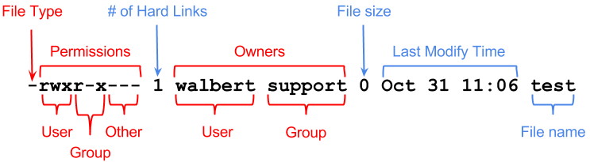

# Files and folders

Learn how to manage files and folders.

<!-- TOC -->
* [Files and folders](#files-and-folders)
  * [Folders (directories)](#folders-directories)
    * [Navigation](#navigation)
      * [Hierarchy](#hierarchy)
    * [Information](#information)
    * [Manipulation](#manipulation)
  * [Files](#files)
    * [Manipulation](#manipulation-1)
    * [Editing](#editing)
    * [Reading](#reading)
    * [Information](#information-1)
    * [Finding](#finding)
  * [Archives](#archives)
  * [Permissions](#permissions)
    * [File/Folder permissions](#filefolder-permissions)
    * [Special permissions](#special-permissions)
      * [SetUID & SetGID](#setuid--setgid)
      * [Sticky bit](#sticky-bit)
      * [Finding files with special permissions set](#finding-files-with-special-permissions-set)
    * [Numeric permissions](#numeric-permissions)
    * [Change file permissions](#change-file-permissions)
    * [File ownership](#file-ownership)
    * [Umask setting](#umask-setting)
    * [ACL (Access Control Lists)](#acl-access-control-lists)
<!-- TOC -->

## Folders (directories)

### Navigation

- `pwd`: print working directory
- `cd <path>`: change directory
    - Use `../` to navigate upwards / to parent directory
    - Use `/<...>` for an absolute path (relative to root folder)
    - Use `~/<...>` for a path relative to the current user home

Always wrap path names with spaces in quotes. (e. g. `"/users/pi/my folder/ex.txt"`)

#### Hierarchy

The file system hierarchy is not identical on all distributions but thanks to the _Filesystem Hierarchy Standard_ (FHS),
there is a typical structure found on almost all distributions.

Current version is FHS 3.0 since 2015.

`/` is the root folder and represents the start of the hierarchy

- `/bin`: Essential user command binaries
- `/boot`: Static files of the bootloader
- `/dev`: Device files
- `/etc`: Editable text configuration / config files
- `/home`: User home directories
  - `/home/tux`: would be `tux`'s home folder
- `/lib`: Essential shared libraries and kernel modules
- `/media`: Mount point for removable media
- `/mnt`: Mount point for temporarily mounted filesystems
- `/opt`: Add-on application software packages
- `/proc`: Virtual filesystems documenting kernel and process status as text files
- `/root`: Home directory for the root user
- `/run`: Run-time variable data
- `/sbin`: System binaries
- `/srv`: Data for services provided by this system
- `/sys`: Information about devices, drivers and some kernel features
- `/tmp`: Temporary files; often cleared on reboot
- `/usr`: Read-only user data; (Multi-)User utilities and applications
  - `/usr/local`
    - `/usr/local/bin`
- `/var`: Variable files
  - `/var/cache`: Application cache data
  - `/var/log`: Logs
  - `/var/run`: Link to `/run`
  - `/var/tmp`: Temporary files preserved between reboots

### Information

- `ls [folder]`: list the items in the currect or specified folder
- `ls -l [folder]`: same, but with details
- `ls -ld [folder]`: get infos about the current or specified folder

(Image source: www.ics.uci.edu - check out [file permissions](#permissions) to understand the permission bits)

### Manipulation

- `mkdir <path>`: create a directory
- `rmdir <path>`: delete a directory

## Files

### Manipulation

- `touch <path>`: create an empty file
- `rm <path>`: delete a file
- `cp <path_old> <path_new>`: copy a file/dir
- `scp <username@hostname>:<path_source> <path_target>`: copy file from remote to local
- `mv <path_old> <path_new>`: move/rename a file/dir

### Editing

- `nano [+<line>] <path>`: edit (and create) a file with the nano editor
    - `Ctrl+o ENTER Ctrl+x` to save and exit
- `vi <path>`: edit (and create) a file with the vi(m) editor
    - `I` to enter insert mode
    - `Esc` to exit insert mode / enter command mode
    - `:wq` to save and exit
    - `:q!` to exit without save

### Reading

- `cat <path>`: print a file to console
- `b cat <path>`: print an image to console with the _butterfly launcher_ (if installed)
- `tail <path>`: print the end of a file
    - `-n <N>`: print the last N lines
    - `-f`: follow the file for changes and print them continuously
- `less <path>`: read file in scrollable viewer
- `more <path>`: read file in scrollable viewer

### Information

- `wc <file>`: get word count
- `wc -l <file>`: get line count

### Finding

- `find / -name '*searchstring*'`: Searches the file system for a file that includes searchstring in its name.
- `find / -name '*searchstring*' -exec rm {} \;`: Searches the file system for a file that includes searchstring in its
  name and deletes it with the rm command. The backslash and semicolon symbolize the end of the -exec section.
- `grep searchstring /var/myfirstfile`: Searches for the pattern searchstring from the contents of /var/myfirstfile.
    - `-i`: ignore case
    - `-R`: read all files under directories recursiveley and follow symbolic links
    - `-n`: print line number

## Archives

- `tar -czvf <filename>.tar.gz /var/myfirstdirectory`: compress a directory into an archive
- `tar -xzvf <filename>.tar.gz`: extract the archive

More: `zip` and `unzip`

- `unzip [options] <file>`: unzip a file
    - `-j`: into current directory

## Permissions

Every file/folder is owned by a user and a group.

### File/Folder permissions

- Permission groups: _`u`ser_, _`g`roup_ and _`o`thers_.
- Permission types: _`r`ead_, _`w`rite_ and _e`x`ecute_.

Example permissions: `-rwxrwxrwx+`

The first positions stands for file (`-`), folder (`d`) or link (`l`).
The three `rwx` triplets stand for the three permission
groups _`u`ser_, _`g`roup_ and _`o`thers_.

If a `+` is present at the end, it means that an ACL ([Access Control List](#acl-access-control-lists)) is active.

### Special permissions

More on this topic: [here (external link)](https://www.redhat.com/sysadmin/suid-sgid-sticky-bit)

#### SetUID & SetGID

**Files** that have the **setUID** or **setGID** bits set will be executed with the permissions of the owner
(user/group).

Files created in **folders** that have the **setUID** or **setGID** bits set will not belong to the creator but to the
owner (user/group) of the parent folder.

In `ls -l`, this is displayed in place of the `x` bit of the user/group (first/second `rwx` triplet):
`s` = with execute permission; `S` = without execute permission

#### Sticky bit

The **sticky bit** shall only be applied to **folders**. If it is set, only the owner of a file in the folder can
delete or rename it.

In `ls -l`, this is displayed in place of the `x` bit of others (third `rwx` triplet):
`t` = with execute permission; `T` = without execute permission

#### Finding files with special permissions set

- `find / -perm /4000 2>/dev/null`: find files with setUID set
- `find / -perm /2000 2>/dev/null`: find files with setGID set
- `find / -perm /1000 2>/dev/null`: find files with sticky bit set

### Numeric permissions

Permissions can also be represented using the octal (base 8) system.

Each of the three `wxr` triplets (owner user, owner group, others) is represented as one octal integer.
`w` stands for 4, `x` for 2 and `r` for 1.

- Example 1: `rwxr-xr-x` = 755
- Example 2: `rwxr-x---` = 750

Special permissions are represented by one octal digit before the others.

Numeric values:

<table>
    <thead>
        <tr>
            <th>Group</th>
            <th colspan="3">(Special perms)</th>
            <th colspan="3"><u>U</u>ser</th>
            <th colspan="3"><u>G</u>roup</th>
            <th colspan="3"><u>O</u>thers</th>
        </tr>
    </thead>
    <tbody>
        <tr>
            <th>Perm</th>
            <td>setUID</td><td>setGID</td><td>sticky bit</td>
            <td>r</td><td>w</td><td>x</td>
            <td>r</td><td>w</td><td>x</td>
            <td>r</td><td>w</td><td>x</td>
        </tr>
        <tr>
            <th>Value</th>
            <td>4000</td><td>2000</td><td>1000</td>
            <td>400</td><td>200</td><td>100</td>
            <td>40</td><td>20</td><td>10</td>
            <td>4</td><td>2</td><td>1</td>
        </tr>
    </tbody>
</table>

### Change file permissions

File permissions can be changed via `chmod <perm/num> <path>` command.

- `chmod +x <path>`: add execute permission to all three groups
- `chmod g+w <path>`: add write permission to the owner group
- `chmod o=r <path>`: only allow others to read
- `chmod o-wx <path>`: remove write and execute permissions from others
- `chmod -w <path>`: make the file read-only
- `chmod u+s <path>`: set setUID bit
- `chmod g+s <path>`: set setGID bit
- `chmod +t <path>`: set sticky bit
- `chmod NUM <path>`: set [numeric permissions](#numeric-permissions)

(no letter before the symbol or `a` stands for all of them)

### File ownership

- `chown <username> <path>`: transfer user ownership
- `chown <username>:<group> <path>`: transfer user and group ownership
- `chown :<group> <path>`: transfer group ownership
- `chgrp <group> <path>`: transfer group ownership

### Umask setting

The umask setting defines, what permissions are _removed_ by default on file/folder creation. Special permissions
cannot be changed by the umask setting.

- File permissions = 0777 - umask
- Folder permissions = 0666 - umask

The umask can be set via `umask` command:
- `umask <num>`

### ACL (Access Control Lists)

ACLs can be used to allow more users to access a file or folder.

- `getfacl -a -e <file/folder>`
- `setfacl -m PERMS <file/folder>`

Example for PERMS: `user:uStudent3:rwx,group:gClass2:rx` or `g:gClass2:r-x`
